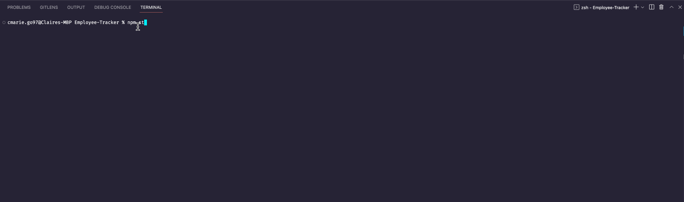

# Employee-Tracker

## Description

This application combined the principals of MySQL and Node.js to create an command-line application that allows non-developers to easily view and interact with a database. This CLI application allows management or business owners to view and manage their departments, roles, and employees. 

Demo Video Link: (https://streamable.com/sxe063)

## Table of Contents

- [Installation](#installation)
- [Usage](#usage)
- [Credits](#credits)
- [License](#license)

## Installation

The following packages are required to run this application: inquirer, mysql2, and console.table. Run the following command in the command line to initialize a new package:

~~~
npm init
~~~

Then, run the following command in the command line to install the inquirer package:

~~~
npm i inquirer@8.2.4
~~~

Then, run the following command in the command line to install the mysql2 package:

~~~
npm i mysql2
~~~

Then, run the following command in the command line to install the console.table package:

~~~
npm install console.table --save
~~~
## Usage

To run this application, enter the following command in the CLI:

~~~
npm start
~~~

The user will be prompted with a list of options to choose from. Use the arrow keys to scroll through options and use the "Enter" key to select an option. Some options will display tables, and some have associated questions for the user to answer

## License

---

## Badges

## How to Contribute

Ways to contribute include suggesting bug fixes and ideas for new features. 